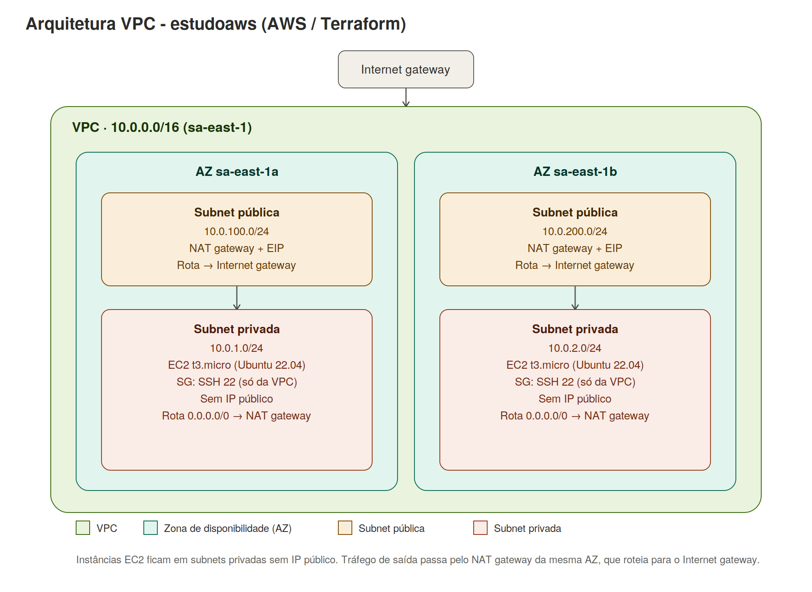

# Estudoaws — VPC multi-AZ com NAT Gateway na AWS (Terraform)

Projeto de estudo de Terraform que provisiona, na AWS, uma topologia de rede em alta
disponibilidade: uma VPC com subnets públicas e privadas espalhadas por 2 zonas de
disponibilidade, saída à internet via NAT Gateway e instâncias EC2 isoladas em subnets
privadas.

## O que este projeto cria

- 1 **VPC** (`10.0.0.0/16`)
- 2 **zonas de disponibilidade** (por padrão `sa-east-1a` e `sa-east-1b`)
- 2 **subnets públicas**, uma por AZ (`10.0.100.0/24` e `10.0.200.0/24`)
- 2 **subnets privadas**, uma por AZ (`10.0.1.0/24` e `10.0.2.0/24`)
- 1 **Internet Gateway**, para dar acesso à internet às subnets públicas
- 2 **NAT Gateways** (um por AZ), cada um com seu próprio IP elástico, permitindo que as
  subnets privadas acessem a internet apenas para **saída**
- Route tables e associações próprias para subnets públicas e privadas
- 1 **Security Group** compartilhado, liberando SSH (porta 22) somente de dentro da VPC e
  todo o tráfego de saída
- 2 **instâncias EC2** (`t3.micro` por padrão), uma em cada subnet privada, usando a AMI
  Ubuntu 22.04 mais recente disponível na região

## Arquitetura



As instâncias EC2 ficam em subnets privadas e **não têm IP público nem são acessíveis via
SSH de fora da VPC**. Para saída à internet (ex.: instalar pacotes), o tráfego é roteado pelo
NAT Gateway da mesma zona de disponibilidade, que por sua vez usa o Internet Gateway.

## Estrutura dos arquivos

```
terraform/
├── backend.tf            # Configuração do backend do state
├── providers.tf          # Provider AWS
├── variables.tf          # Variáveis de entrada (região, CIDRs, AZs, tipo de instância, etc.)
├── terraform.tfvars      # Valores usados neste ambiente
├── vpc.tf                # VPC, Internet Gateway, IPs elásticos e NAT Gateways
├── subnets.tf            # Subnets públicas e privadas (uma de cada por AZ)
├── route_tables.tf       # Route tables públicas/privadas e suas associações
├── security_groups.tf    # Security Group das instâncias EC2
├── ec2.tf                # Instâncias EC2 + lookup automático da AMI Ubuntu
└── outputs.tf            # Saídas: IDs de VPC/subnets/instâncias e IPs privados
```

## Pré-requisitos

- [Terraform](https://developer.hashicorp.com/terraform/downloads) instalado
- Uma conta AWS com permissão para criar VPC, EC2, NAT Gateway, EIP, etc.
- Credenciais AWS configuradas

## Como usar

1. Ajuste as variáveis em `terraform/terraform.tfvars` conforme sua conta/região
   (`aws_region`, `availability_zones`, CIDRs, `instance_type`, `key_name`, etc.).

2. Configure suas credenciais AWS (uma das opções):
   ```bash
   aws configure
   # ou
   export AWS_ACCESS_KEY_ID="..."
   export AWS_SECRET_ACCESS_KEY="..."
   ```

3. Entre na pasta do projeto e inicialize o Terraform:
   ```bash
   cd terraform
   terraform init
   ```

4. Veja o plano de execução:
   ```bash
   terraform plan
   ```

5. Aplique:
   ```bash
   terraform apply
   ```

6. Para destruir tudo depois:
   ```bash
   terraform destroy
   ```
Ou simplesmente rodar a pipelina configurada no GitHub Actions

## Acessando as instâncias privadas

Como as instâncias ficam em subnets privadas, não é possível conectar via SSH diretamente da
sua máquina. Opções comuns para isso:

- **Bastion host**: uma instância em subnet pública que serve de "ponte" via SSH até as
  instâncias privadas.
- **VPC Endpoints + AWS Systems Manager (SSM)**: acessa o terminal da instância via Session
  Manager, sem precisar de SSH nem IP público.

## Custos

Este projeto cria recursos que **geram custo na AWS**, mesmo em baixo uso — principalmente os
2 NAT Gateways e os IPs elásticos associados a eles. Lembre-se de rodar `terraform destroy`
ao terminar os testes para evitar cobranças indevidas.

## Próximos passos que irei realizar

- Adicionar um Auto Scaling Group
- Adicionar Load Balance
- Adicionar Instâncias EC2 nas subnetes públicas
- Extrair os recursos repetidos (VPC, subnets, NAT) para módulos Terraform reutilizáveis